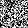
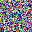
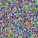

# ARFM: Auto-Regressive Flow Matching

**ARFM** is a generative model built on Flow Matching that introduces a **spatially heterogeneous time field** to implicitly achieve auto-regressive image generation — images are synthesized progressively from center to edges.

Conditional generation(CFG=4) in MNIST: 

<p align="center">
  
</p>

Auto-regressive flow sampling trajectories on MNIST, CIFAR-10, and CelebA:

<p align="center">
  
  
  
</p>

## Key Features

- **Center-Out AR Generation**: A spatially heterogeneous time field schedules each pixel's evolution independently — center pixels mature first, edge pixels follow — producing a natural center-to-edge diffusion pattern.
- **SPADE U-Net Backbone**: Spatially-Adaptive Normalization injects per-pixel time conditioning into every normalization layer, enabling the network to handle heterogeneous temporal states across the image.
- **Classifier-Free Guidance (CFG)**: Supports label-conditional generation with trainable CFG for higher sample quality and controllability.
- **Multiple Datasets**: Supports MNIST, CIFAR-10, and CelebA out of the box.

## How It Works

### Spatially Heterogeneous Time Field

The core idea is to replace the uniform scalar time $t$ in standard Flow Matching with a **spatial time map** $t_{\mathrm{map}}(x, y, \tau)$, where $\tau \in [0,1]$ is the global ODE time and $(x, y)$ is the pixel position.

For each pixel, we first compute its normalized Euclidean distance from the image center: $r = \| (x,y) - c \| / r_{\max}$, where $r \in [0, 1]$. The local startup time and local time are then defined as:

$$\tau_{\mathrm{start}}(r) = \alpha \cdot r^{\beta}, \qquad t = \mathrm{clamp}\!\left(\frac{\tau - \tau_{\mathrm{start}}(r)}{1 - \tau_{\mathrm{start}}(r)},\ 0,\ 1\right)$$

where $\alpha$ is the edge startup delay and $\beta$ is the distance power. At $\tau=0$ all pixels are near pure noise ($t \approx 0$); at $\tau=1$ all pixels complete ($t \approx 1$). During generation, center pixels evolve first while edge pixels lag behind and catch up later.

### SPADE Conditioning

Each pixel receives independent time conditioning through Spatially-Adaptive Normalization:

$$\mathrm{output} = \hat{x} \cdot \bigl(1 + \gamma(t_{\mathrm{map}})\bigr) + \beta(t_{\mathrm{map}})$$

where $\hat{x}$ is the normalized feature map, and $\gamma(\cdot), \beta(\cdot)$ are spatially-varying affine parameters predicted from $t_{\mathrm{map}}$. This allows the U-Net to handle the spatially varying temporal state without any hard masks or multi-pass generation.

### Unbiased Flow Matching Loss

The training objective is derivative-weighted MSE. Given noise sample $\mathbf{x}_0 \sim \mathcal{N}(0, I)$, ground-truth image $\mathbf{x}_1$, and intermediate state $\mathbf{x}_\tau = (1 - t_{\mathrm{map}}) \odot \mathbf{x}_0 + t_{\mathrm{map}} \odot \mathbf{x}_1$, the loss is:

$$\mathcal{L} = \left\| \mathbf{v}_\theta(\mathbf{x}_\tau,\, t_{\mathrm{map}}) - (\mathbf{x}_1 - \mathbf{x}_0) \right\|^2 \cdot \frac{\partial t}{\partial \tau}$$

The weight $\frac{\partial t}{\partial \tau}$ arises naturally from the change-of-variables in the continuous Flow Matching integral. Regions that have not started evolving or have already completed receive zero weight — no hard masking needed.

## Installation

```bash
git clone https://github.com/your-username/ARFM.git
cd ARFM
pip install torch torchvision torchmetrics numpy matplotlib seaborn tqdm pillow
```

**Requirements**: Python 3.8+, PyTorch 2.0+, CUDA (recommended for training).

## Quick Start

### Training

```bash
# Unconditional generation on MNIST
python train.py --epochs 100 --batch_size 128

# Conditional generation with CFG on CIFAR-10
python train.py --dataset cifar10 --use_labels --use_cfg --cfg_drop_prob 0.1 \
  --use_augmentation --epochs 200 --batch_size 64

# Full configuration example
python train.py \
  --dataset cifar10 \
  --epochs 100 --batch_size 64 \
  --lr 2e-4 --weight_decay 1e-4 --warmup_epochs 5 \
  --base_channels 64 --channel_mult 1 2 4 8 16 --num_res_blocks 2 \
  --use_labels --use_cfg --cfg_drop_prob 0.1 \
  --use_ema --ema_decay 0.9999 \
  --time_start_delay 0.3 --time_power 1.0
```

### Sampling

```bash
# Unconditional generation
python sample.py --checkpoint outputs/{dataset}_{time}/best_model.pt --num_samples 100

# Conditional generation (digit "5" with CFG)
python sample.py --checkpoint outputs/{dataset}_{time}/best_model.pt --label 5 --cfg_scale 1.5

# Save generation trajectory to visualize AR behavior
python sample.py --checkpoint outputs/{dataset}_{time}/best_model.pt --save_trajectory
```

### Evaluation

```bash
# FID evaluation
python evaluate.py --checkpoint outputs/{dataset}_{time}/best_model.pt --num_samples 5000
```

## Project Structure

```
ARFM/
├── arflow/                  # Core library
│   ├── __init__.py          # Module exports
│   ├── time_field.py        # Spatially heterogeneous time field
│   ├── model.py             # SPADE U-Net backbone
│   ├── solver.py            # Euler samplers
│   ├── ema.py               # Exponential Moving Average
│   └── utils.py             # Utility functions
├── data_loader.py           # Unified data loading (MNIST/CIFAR-10/CelebA)
├── train.py                 # Training script
├── sample.py                # Sampling / inference script
├── evaluate.py              # FID evaluation script
└── data/                    # Dataset storage
```

## Key Hyperparameters

### Time Field

| Parameter | Default | Description |
|-----------|---------|-------------|
| `--time_start_delay` | 0.3 | Edge startup delay coefficient. Larger = stronger AR behavior. |
| `--time_power` | 1.0 | Distance exponent. Controls how delay scales with distance from center. |

### Model

| Parameter | Default | Description |
|-----------|---------|-------------|
| `--base_channels` | 64 | Base channel count of the U-Net. |
| `--channel_mult` | 1 2 4 8 16 | Channel multiplier per depth level. |
| `--num_res_blocks` | 2 | Number of residual blocks per level. |
| `--spade_hidden_nc` | 128 | SPADE hidden dimension. |
| `--attention_heads` | 4 | Number of attention heads in deeper layers. |

### Training

| Parameter | Default | Description |
|-----------|---------|-------------|
| `--lr` | 2e-4 | Learning rate. |
| `--cfg_drop_prob` | 0.1 | Label dropout probability for CFG training. |
| `--cfg_scale` | 1.5 | CFG strength at inference time. |
| `--use_ema` | false | Enable Exponential Moving Average for inference. |

## Supported Datasets

| Dataset | Resolution | Channels | Condition |
|---------|-----------|----------|-----------|
| MNIST | 28 x 28 | 1 (grayscale) | Class label (0-9) |
| CIFAR-10 | 32 x 32 | 3 (RGB) | Class label (10 classes) |
| CelebA | 64 x 64 | 3 (RGB) | 40 binary attributes |

## Citation

If you find this work useful, please consider citing:

```bibtex
@misc{arfm2025eruditionherta,
  title={ARFM: Auto-Regressive Flow Matching with Spatially Heterogeneous Time Fields},
  author={Erudition Herta},
  year={2025},
  url={https://github.com/EruditionHerta/ARFM}
}
```

## License

This project is released under the MIT License.
